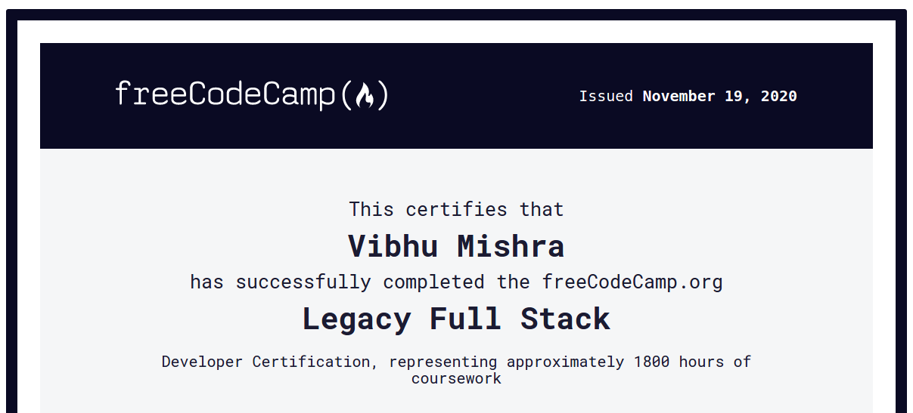

<h1 align='center'>Freecodecamp Challenges :rocket:</h1>
<h4 align ='center'>All the projects or challenges done to recieve the freecodecamp certifications</h4>

### Responsive Web Design Projects

* Build a [Tribute Page](https://codepen.io/Mishra121/pen/xxwYMyG)

* Build a [Survey Form](https://codepen.io/Mishra121/pen/NWGymMR)

* Build a [Product Landing Page](https://codepen.io/Mishra121/pen/oNjERKY) 

* Build a [Technical Documentation Page](https://codepen.io/Mishra121/pen/wvKmLjQ) 

* Build a [Personal Portfolio Webpage](https://codepen.io/Mishra121/pen/GRpxVdb)

* [Certificate](https://www.freecodecamp.org/certification/mishra121/responsive-web-design)

### JavaScript Algorithms and Data Structures 

* [Certificate](https://www.freecodecamp.org/certification/mishra121/javascript-algorithms-and-data-structures)

### Front End Libraries Projects

* Build a [Random Quote Machine](https://codepen.io/Mishra121/full/jOqKadZ) using React :dizzy:

* Build a [Markdown Previewer](https://codepen.io/Mishra121/pen/BaKOaBe) using React :memo:

* [Basic Drum Machine](https://codepen.io/Mishra121/pen/eYZQMxB) using react

* Build a [JavaScript Calculator](https://codepen.io/Mishra121/full/yLOwwQG) with vanilla javascript 

* Build [25 + 5 Clock](https://codepen.io/Mishra121/full/BazaMwd) using React

* [Certificate](https://www.freecodecamp.org/certification/mishra121/front-end-libraries)

### Data Visualization Projects

* Visualize Data with [D3 Bar Chart](https://codepen.io/Mishra121/full/xxOOYQX)

* Visualize Data with a Scatterplot Graph

* Visualize Data with a Heat Map

* Visualize Data with [D3 Choropleth Map](https://codepen.io/Mishra121/pen/rNLbVaZ)

* Visualize Data with a Treemap Diagram

* [Certificate](https://www.freecodecamp.org/certification/mishra121/data-visualization)

### APIs and Microservices Projects

* Build a [Timestamp Microservice](https://repl.it/@Mishra121/boilerplate-project-timestamp) :clock3:

* [Request Header Parser Microservice](https://repl.it/@Mishra121/boilerplate-project-headerparser)

* [URL Shortener Microservice](https://repl.it/@Mishra121/boilerplate-project-urlshortener) :zap:

* [Exercise Tracker REST API](https://repl.it/@Mishra121/boilerplate-project-exercisetracker#README.md)

* Build a File Metadata Microservice

* [Certificate](https://www.freecodecamp.org/certification/mishra121/apis-and-microservices)

### freecodecamp certification

* [Link](https://www.freecodecamp.org/certification/mishra121/full-stack) :fire:

